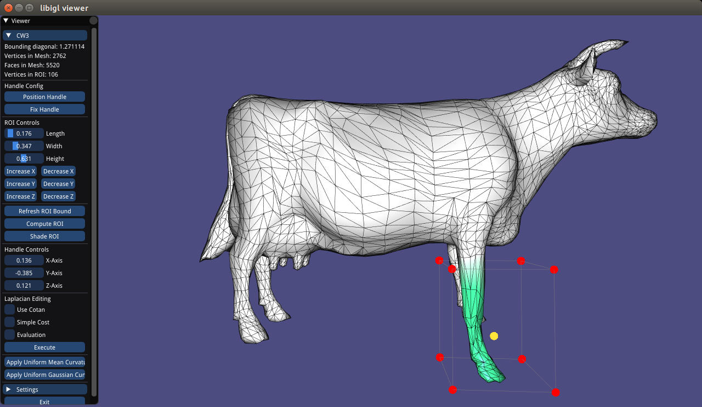

Introduction
---------------

This coursework project considers an approach to mesh deformation as presented by *Sorkine et. al* @Sorkine. Mesh deformation is a central feature in animation, editing and simulation. An example of mesh deformation is shown in the following images, produced from this project's source code.

<p align="center">
    
    
    
</p>

A summary curvature analysis can be performed using mean and gaussian curvatures of the concerned meshes. Below are the mean curvatures of the original and deformed mesh.

<p align="center">
    
    
</p>

Below are the gaussian curvatures of the original and deformed mesh.

<p align="center">
    
    
</p>


The developed project implementation was a collaborative effort between myself and Qndt27 ([github](qndt27)). Mentioned effort was equally divvied in the following way:

-   Dennis - Visualisation (*Evaluation & Analysis*), Implementation of Conventional Cost Function, Evaluation of Conventional Cost Function.

-   Myself - Visualisation (*Region Of Interest*), Implementation of Enhanced Cost Function, Evaluation of Enhanced Cost Function.

We detail a fairly comparative analysis of *Sorkine et
al’s* approach as well as the specifics of this project’s implementation in the following chapters:

-   Summary

-   Implementation

-   Extension

A conclusion chapter is included for completeness.

#### Instructions

The only dependencies are stl, eigen, [libigl](libigl.github.io/libigl/) and
the dependencies of the `igl::opengl::glfw::Viewer`.

We recommend you to install libigl using git via:

```bash
    git clone https://github.com/libigl/libigl.git
    cd libigl/
    git checkout 6ebc585611d27d8e2038bbbf9cb4910c51713848
    git submodule update --init --recursive
    cd ..
```

Once dependecies are installed, you can compile and run this project using the standard cmake routine:

``` bash
    mkdir build
    cd build
    cmake ..
    make
    ./cw_bin
```

A glfw app should launch displaying a 3D cow cube.


Summary
-------------

There are numerous techniques and tools available to perform mesh
deformation, all of which are constrained by the following:

-   Interactivity and Flexibility.

-   Transformation Sensitivity.

-   Global Reconstruction Cost.

-   Local Detail Preservation.

In an effort to equally address the above, *Sorkine et al* @Sorkine
asserts that mesh deformation is best addressed when dealing with
intrinsic/local surface representations as opposed to extrinsic/global
variants. This encoding of geometry details is implemented by utilising
the differential properties of the surface and is further justified by
it’s preservation of local shape (or surface detail). A limitation of
intrinsic representations is the global reconstruction cost incurred in
solving for a linear system of equations (SLE). This is addressable
using alternative representation schemes such as multi-resolution
decompositions that involves the construction of non-regular base
domains using subdivision techniques @Mario @Sorkine. Techniques such as
the latter exhibit simpler to compute global reconstructions as they are
purely additive procedures. Table \[table:ReprComp\] presents the main
comparative characteristics of both approaches.

#### Representation Scheme Characteristics

|            Characteristics            |  Differential  |  Multi-resolution
|  ------------------------------------ | -------------- | ------------------
|     Low Global Reconstruction Cost    |                |       :heavy_check_mark:
|   Low Local Detail Preservation Cost  |      :heavy_check_mark:         |
|        Flexible Editing Region        |      :heavy_check_mark:         |
|       Transformation Sensitivity      |      :x:         |      :x:

The major contributions presented in the reference paper include:

-   Rotation and Scale Invariant (RSI) Laplacian Coordinates.

-   Interactive detail-preserving surface editing.

-   Transfer of geometric detail (coating).

-   Transplanting surface patches with homomorphic boundaries.

The papers’ core mathematical treatments will be briefly justified in RSI Laplacian Coordinates sub-chapter below. A more extensive overview is detailed in the Implementation chapter. The 3 latter contributions are applications of the implemented mathematical algorithms. Ultimately, they present novel mesh editing uses that are largely associated with the conservation, transfer and blending of geometric details.

### RSI Laplacian Coordinates

When considering geometric positioning, concerted emphasis must be placed on the produced solutions’ sensitivity to varied transformations. Summarily, there are two classifications of transformations; rigid and non-rigid, the former of which is under consideration in *Sorkine et al’s* work. Conventional Laplacian Coordinates, while invariant under translation (of absolute geometry) are however sensitive to scaling and rotation. This paper proposes a solution to rotation and isotropic scaling through the RSI Laplacian Coordinates System. The main distinction between the two is in the added per vertex computation of linear, mesh reconfiguration transformations when computing the error functionals as shown in Equations \[eq:Econ\] and \[eq:Ersi\] in the Implementation chapter.

### Interactive detail-preserving surface editing

This involved the development of a user interface that utilised handles and Region of Interests (ROIs) as the main mesh deformation tools. Users manipulate the handle to convincingly (as would occur with physical soft materials) propagate global deformations through the user-defined ROI.

### Transfer of geometric detail

The geometric detail of a source mesh as stored in the RSI Laplacian Coordinates can be transferred to a target surface. This is made possible by selectively extracting high-frequency details from the surface. When the target is a smoothed version of the source, faithful reconstruction is possible. In scenarios where it is not, the target must be smoothed and the coating aligned to it. This is made possible by the following Laplacian Coordinate property:

$$R \cdot L^{-1}(\delta_j) = L^{-1}(R \cdot \delta_j)$$

Where $R$ is the coatings’ alignment/rotation matrix and $L^{-1}$ is the transformation from Laplacian Coordinates to absolute/extrinsic coordinates.

### Transplanting surface patches with homeomorphic boundaries

The technique presented requires matching boundary topologies (homeomorphism) between the source and target mesh. An additional enhancement included in the proposed implementation allows for seamless transplanting of one shape onto another. Consisting of two distinct tasks, topological and geometric operations, consistent triangulations and gradual geometric structure change are respectively applied to complete the transplantation.

Implementation
--------------

Through the use of Laplacian Coordinates that encode local mesh geometries, Sorkine et. al @Sorkine propose a Laplacian fitting strategy that is shown to preserve shape detail.

As mentioned in the previous chapter, the core mathematical treatments presented in the concerned paper considered the formulation of error functionals. Whereas the conventional quadratic minimization problem in Equation \[eq:Econ\] is less computationally expensive than the formulation in Equation  [eq:Ersi\], it is inherently sensitive to linear transformations. Equation \[eq:Ersi\] addresses this with the addition of the per vertex computation of a mesh reconfigured transformation matrix, $T_i$.

$$
    E(V')_{conventional} = \underset{i=1}{\overset{n}{\sum}} \left\|\delta_i - L(\boldsymbol{v'_i})\right\|^2 + \left\|\boldsymbol{v'_i} - \boldsymbol{u_i}\right\|^2$$

$$
    E(V')_{enhanced} = \underset{i=1}{\overset{n}{\sum}} \left\|T_i(V')\delta_i - L(\boldsymbol{v'_i})\right\|^2 + \left\|\boldsymbol{v'_i} - \boldsymbol{u_i}\right\|^2$$

### Conventional Error Functional

As detailed in Mario et. al @Mario, the quadratic minimization problem in Equation \[eq:Econ\] is minimized with *soft* constraints by solving the overdetermined *(n + k) x n* system shown in Equation \[eq:QMP\] below in the least-squares sense:

$$
        \begin{pmatrix}
            & \boldsymbol{L} \\
            0 & \lambda \boldsymbol{I}_k
        \end{pmatrix}
        \begin{pmatrix}
            \boldsymbol{v'_1} \\
            \vdots \\
            \boldsymbol{v'_n} \\
        \end{pmatrix}
        =
        \begin{pmatrix}
            \boldsymbol{\delta'}_1 \\
            \vdots \\
            \boldsymbol{\delta'}_n \\
            \lambda \boldsymbol{v}_{n+1} \\
            \vdots \\
            \lambda \boldsymbol{v}_ n \\
        \end{pmatrix}$$

Where $\lambda$ is a chosen and sufficiently large weight whose value is proportional to the system’s condition number, thereby affecting it’s numerical stability when reformulated into the *n x n* normal equations in \[eq:QMP2\] below:

$$
        \begin{bmatrix}
            \boldsymbol{L}^T\boldsymbol{L} +
            \begin{pmatrix}
                \boldsymbol{0} & \boldsymbol{0} \\
                \boldsymbol{0} & \lambda^2 \boldsymbol{I}_k
            \end{pmatrix}
        \end{bmatrix}
        \begin{pmatrix}
            \boldsymbol{v}_1 \\
            \vdots \\
            \boldsymbol{v}_n
        \end{pmatrix}
        =
        \boldsymbol{L}^T
        \begin{pmatrix}
            \boldsymbol{\delta}'_1 \\
            \vdots \\
            \boldsymbol{\delta}'_n
        \end{pmatrix} +
        \begin{pmatrix}
            \boldsymbol{0} \\
            \vdots \\
            \boldsymbol{0} \\
            \lambda^2 \boldsymbol{v}_{n+1} \\
            \vdots \\
            \lambda^2 \boldsymbol{v}_ n \\
        \end{pmatrix}$$

In the C++ implementation provided with this report, Equation \[eq:QMP\] was utilised and solved for using Eigen’s SparseQR solver method.

### Enhanced Error Functional

To ensure that local detail preservation is maintained in Equation \[eq:Econ\], certain constraints must placed on the derive-able transformations. Otherwise, the error functional resolves to a membrane solution that discards geometric detail. Said constraints are implemented by considering the necessary transformation invariance properties (translation, rotation and isotropic scale) and reformulating the transformation matrix using established matrix algebra properties. Homogeneous coordinates, characterized by appending an additional row to all regarded matrices and vectors, allows us to account for translation invariance. Isotropic scales and rotation invariance is enforced by the use of the following mathematically-described class of matrices;

$$
    \boldsymbol{T}_i = s\exp(\boldsymbol{H})
\\
    \boldsymbol{T}_i = s(\alpha \boldsymbol{I} + \beta \boldsymbol{H} + \gamma \boldsymbol{h}^T \boldsymbol{h})
$$

Where $H$ is a 3D skew-symmetric matrix whose properties were exploited to derive the above reformulation. A linear approximation of the above class of constrained equations is given shown below:

$$
    \boldsymbol{T}_i = \begin{bmatrix}
    s & -h_3 & h_2 & t_x \\
    h_3 & s & -h_1 & t_y \\
    -h_2 & h_1 & s & t_z \\
    0 & 0 & 0 & 1
    \end{bmatrix}$$

The above approximation is only valid for small rotation angles; a caveat of the implementation. Given Equation \[eq: T\_i\], the explicit linear dependancy between $T_i$ and $V'$ (the eventual mesh configuration) can the be formulated as shown in Equation  [9\] in @Sorkine as a solvable linear least-squares problem (Equation \[12\] in @Sorkine). The considered work @Sorkine posits a validation enhancement to the above formulation of the transformation matrices to account for two deficiencies:

-   Larger rotation angles.

-   Application of anisotropic scaling.\

If the transformation validation step fails, the system is solved again.

Extension
---------

In the extension to this project, a requested feature was the implementation of curvature measures for evaluation purposes, a
comparative implementation of the conventional and enhanced error
functionals as well as an improvement to the mesh discretization;
allowing for both uniform and cotangent weights in the Laplacian
computation.

Mean and Gaussian curvature measures were included and adapted to the developed project. These allowed for a visual and statistically valid approach to mesh analysis as will be covered in the following Evaluation chapter. The implementation of Mean curvature was performed based on the following equation:

$$H_i = \frac{\Delta\boldsymbol{x}}{2}$$

Whereas the Gaussian Curvature was computed using the angle deficit formula as given below:

$$K_i = (2 \pi - \underset{j}{\Sigma}\theta_j)$$

Where $\theta$ was computed as follows

$$\theta_{i,j} = \arccos\left(\frac{(\boldsymbol{\bar{a}}_i \cdot \boldsymbol{\bar{b}}_i)}{(||\boldsymbol{\bar{a}}_i|| \times ||\boldsymbol{\bar{b}}_i||)}\right)$$

With $i$ is the vertex index in the range $[1,..,m]$ and $j$ is the face index in the range $[1,..,n]$.\ The error functional implementations are covered in the Implementation chapter and the cotangent discretization implemented using the following formula:

$$\Delta_{s}f(v_i) = \frac{1}{2A(v_i)}\underset{v_j\exists\it{N_i(v_i)}}{\Sigma}\left(\cot\alpha_{ij} + \cot\beta_{ij} \right)\left(f(v_i) - f(v_i)\right)$$

Conclusion and Improvements
---------------------------

In ending, a number of notable additions and future work is proposed. The use of Barycentric Cells in the computation of the area normalization factor for cotangent discretization should be replaced with Mixed Cells that provide better area approximations. Additionally, in Equation \[eq:Econ\]s’ incorporation of *soft* constraints, an assumed value of 1 is used for the $\lambda$ value. While not a cause for major concern in the implemented project as yet, the use of more complex mesh geometries would necessitate the use of *hard* constraints. This is better described in @Mario. The GUI as currently presented is arguably arcane in use; more intuitive cursor-based interactions would help improve the interactivity of the system.

References
========

SORKINE, O., COHEN-OR , D., LIPMAN , Y. , ALEXA , M., ROSSL , C., and SEIDEL , H. (2004). *Laplacian Surface Editing*. In Proceedings of the Eurographics/ACM SIGGRAPH Symposium on Geometry Processing. 179-188.

BOTSCH, M., SORKINE, O. (2008). *On Linear Variational Surface Deformation Methods*. IEEE transactions on visualization and computer graphics. 213-30.
